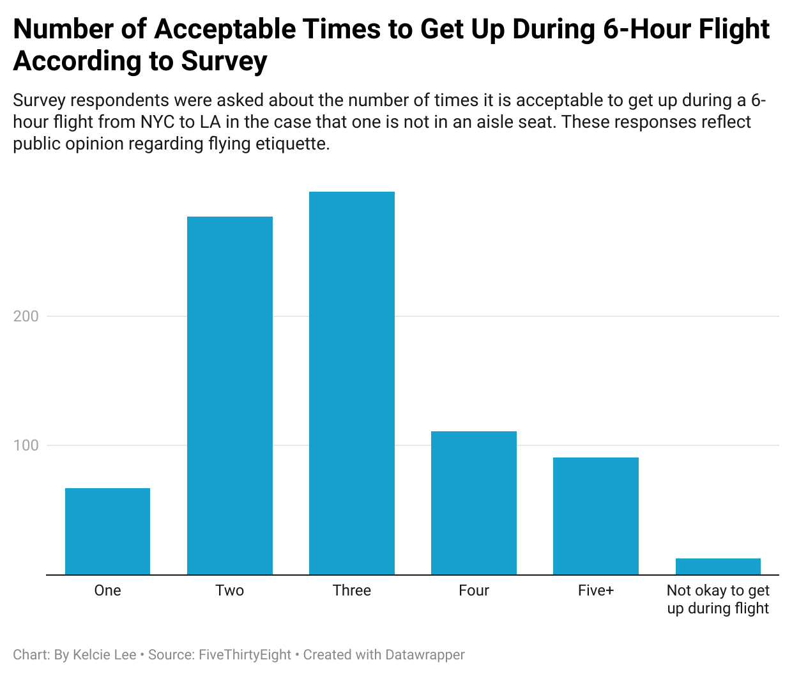

# Flying Etiquette Survey Data

I picked the question above because I thought it was really relevant and interesting to see what people thought about how often it is okay to get up during a flight. I always feel self-conscious about getting up during flights and get anxious about asking people to move or stepping over someone while they’re asleep — that is why I found this dataset interesting. I know there are a variety of answers as to what people deem acceptable, and I was curious as to what public opinion might be on this. 

**This column chart shows how many times people deem the acceptable amount of get ups during a 6-hour flight, with the options of one, two, three, four, five+, and not okay to get up during flight. The chart reveals that most people feel two to three times is the acceptable amount of times to get up during a 6-hour flight.** 
